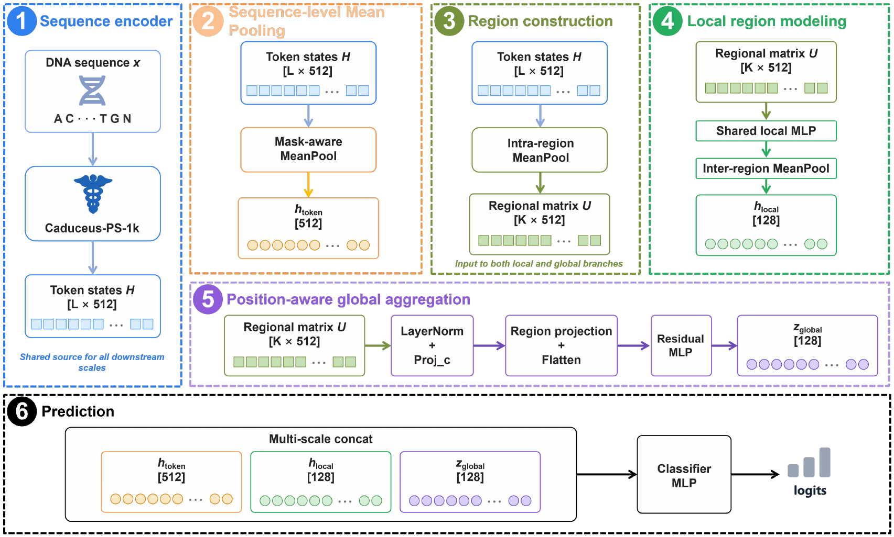

# HiLA-DNA

**A Hierarchical Latent Representation Adapter for DNA Regulatory Element Prediction**

Built on top of the compact [Caduceus-PS-1k](https://huggingface.co/kuleshov-group/caduceus-ps_seqlen-1k_d_model-256_n_layer-4_lr-8e-3) DNA foundation model, HiLA-DNA is a lightweight adapter for binary classification of DNA regulatory elements (promoters, enhancers, and histone-mark regions). It explicitly organizes backbone hidden states at three representation scales — **token**, **regional (block)**, and **global** — without modifying the backbone architecture. The adapter and classification head together add roughly **314K trainable parameters**.



*Figure 1. Overall architecture of HiLA-DNA. The Caduceus hidden states are first mean-pooled to form the sequence-level representation. The same hidden states undergo intra-region mean pooling to obtain an ordered regional matrix. The local branch extracts a region-order-invariant local latent representation, while the global branch uses a channel–region separable projection to model a position-aware global latent representation. The three representations are concatenated for classification.*

***

## Method

Given a DNA sequence, Caduceus-PS-1k outputs token states `H [L × 512]`. HiLA-DNA builds three vectors:

1. **Token-level** — mask-aware mean pooling of `H` gives `h_token [512]`, the baseline representation, retained rather than replaced.
2. **Regional (local)** — partition `H` into contiguous blocks (`block_size` = 50 bp for 1-kbp sequences, 25 bp otherwise); intra-region mean pooling forms `U [K × 512]`; a shared local MLP followed by inter-region mean pooling gives `h_local [128]`.
3. **Global (position-aware)** — `U` is normalized and projected along the channel axis (`Proj_c`, 512 → 32), then along the region axis (`K → 4`); the 4 × 32 core is flattened and refined by a residual MLP (bottleneck 64) to give `z_global [128]`.

The three vectors are concatenated and fed to a two-layer classifier MLP:

```
h_cls = concat(h_token [512], h_local [128], z_global [128])  → logits
```


## Repository Layout

```
.
├── configs/                 # 8 released YAML configs: 4 datasets × 2 settings
│   ├── hila_*.yaml         # HiLA-DNA configs
│   └── caduceus_baseline_frozen_*.yaml     # Same-backbone frozen-head baselines
├── src/
│   ├── train.py             # Unified training / validation / test entry point
│   ├── datasets/            # CSV dataset (columns: sequence, label)
│   ├── models/
│   │   ├── caduceus_hila.py          # Caduceus + HiLA adapter wrapper
│   │   ├── hila_adapter.py           # Hierarchical adapter & all pooling variants
│   │   ├── caduceus_baseline.py      # Baseline wrapper (same backbone + linear head)
│   │   ├── caduceus_wrapper.py       # Caduceus model aliases / RCPS dim handling
│   │   ├── hyenadna_baseline.py      # HyenaDNA baseline (used in the paper)
│   │   └── dnabert2_baseline.py      # DNABERT-2 baseline (used in the paper)
│   ├── metrics/             # Accuracy, F1, MCC, AUROC, AUPRC
│   └── losses/
├── environment.yaml         # Conda environment (name: hila_dna)
└── data/                    # Placeholder directories only — datasets are NOT included
```

## Installation

Requirements: Linux, an NVIDIA GPU with CUDA 12.x, and a recent Conda.

```bash
conda env create -f environment.yaml
conda activate hila_dna
```

Notes:

- The environment pins Python 3.10, PyTorch 2.5.1 (CUDA 12.4), Transformers 4.40.2, and [`mamba-ssm`](https://github.com/state-spaces/mamba) 2.2.6, which Caduceus depends on. Building `mamba-ssm` requires a matching CUDA toolkit (`nvcc`) and `ninja` (already listed).
- On first run the Caduceus-PS-1k weights are downloaded automatically from Hugging Face; the wrapper uses `trust_remote_code=True`.

## Data Preparation

The loader expects simple CSV files with exactly two columns, `sequence` and `label` (binary 0/1):

```
data/processed/<dataset_name>/train.csv
data/processed/<dataset_name>/val.csv
data/processed/<dataset_name>/test.csv
```

The four datasets are public and are **not** redistributed here; please obtain them from the upstream sources and convert them into the CSV layout above:

| Dataset                   | Task                   |  Length | Source                                                                       |
| ------------------------- | ---------------------- | ------: | ---------------------------------------------------------------------------- |
| `H3K4me3`                 | Histone-mark region    | 1000 bp | Nucleotide Transformer benchmark                                             |
| `enhancers`               | Enhancer prediction    |  400 bp | Nucleotide Transformer benchmark                                             |
| `promoter_no_tata`        | Promoter (no TATA-box) |  300 bp | Nucleotide Transformer benchmark                                             |
| `human_nontata_promoters` | Non-TATA promoter      |  251 bp | [GenomicBenchmarks](https://github.com/ML-Bioinfo-CEITEC/genomic_benchmarks) |

The official training split is further divided 90/10 into train/validation; the test split is kept unchanged. `data/raw/` and `data/processed/` are git-ignored, and only `.gitkeep` placeholders are tracked.

## Usage

```bash
conda activate hila_dna

# HiLA-DNA on H3K4me3 
python -m src.train --config configs/hila_H3K4me3.yaml

# Same-backbone frozen baseline on H3K4me3 
python -m src.train --config configs/caduceus_baseline_frozen_H3K4me3.yaml
```

Each run writes to the directory specified by `output.output_dir`:

- `config.yaml` — frozen copy of the run configuration;
- `train_log.csv` — per-epoch train/val losses and validation metrics;
- `best_model.pt` — checkpoint with the best validation MCC (early stopping enabled by default);
- `val_metrics.json` — metrics at the best epoch;
- `test_metrics.json`, `test_predictions.csv` — produced only when `evaluation.run_test: true`.

The released HiLA configs set `run_test: false` (validation-only); the frozen baseline configs include a `test_csv` path and run the held-out test evaluation.

## Citation

If you use this code, please cite the paper (venue information to be updated):

```bibtex
@article{xue2026hiladna,
  booktitle={2025 International Conference on Machine Intelligence and Nature-Inspired Computing (MIND)}, 
  title   = {HiLA-DNA: A Hierarchical Latent Representation Adapter for DNA Regulatory Element Prediction},
  author  = {Xue, Wutong and Jin, Haochang and Xu, Dong and Yang, Hailiang and Ji, Junkai},
  year    = {2026},
  keywords={DNA foundation models; hierarchical representation; latent representation adapter; regulatory element prediction},
  note    = {Manuscript under submission}
}
```

***

## 中文说明

**HiLA-DNA** 是面向 DNA 调控元件（启动子、增强子、组蛋白修饰区域）二分类任务的轻量分层潜在表示适配器，构建于紧凑的 Caduceus-PS-1k 基础模型之上，适配器与分类头合计仅新增约 **314K** 可训练参数，且不修改骨干网络结构。

**核心思想**：调控序列天然具有"局部基序 → 区域组合 → 全局上下文"的多尺度层级。HiLA-DNA 从同一份骨干隐状态出发构建三种表示并拼接分类：

1. **Token 级** `h_token [512]`：对全序列隐状态做掩码感知均值池化（保留 baseline 表示）；
2. **区域级** `h_local [128]`：按 25/50 bp 分块、块内均值池化得到有序区域矩阵 `U [K×512]`，经共享局部 MLP 与块间均值池化得到对区域顺序不敏感的局部潜在表示；
3. **全局级** `z_global [128]`：先通道投影（512→32）再区域投影（`K→4`）的**通道–区域可分离位置保持投影**，将 4×32 的核心矩阵展平后经残差 MLP精炼，得到位置感知的全局潜在表示。

**快速开始**：

```bash
# 1. 创建环境（Linux + NVIDIA GPU + CUDA 12.x）
conda env create -f environment.yaml
conda activate hila_dna

# 2. 按 "sequence,label" 两列 CSV 准备数据到 data/processed/<数据集>/{train,val,test}.csv
#    四个公开数据集来源见上方英文表格，数据本身不随仓库发布

# 3. 训练
python -m src.train --config configs/hila_H3K4me3.yaml

# 同骨干冻结 baseline
python -m src.train --config configs/caduceus_baseline_frozen_H3K4me3.yaml
```

训练产物（日志、最优 checkpoint、验证/测试指标、逐样本预测）写入配置中的 `output.output_dir`。
